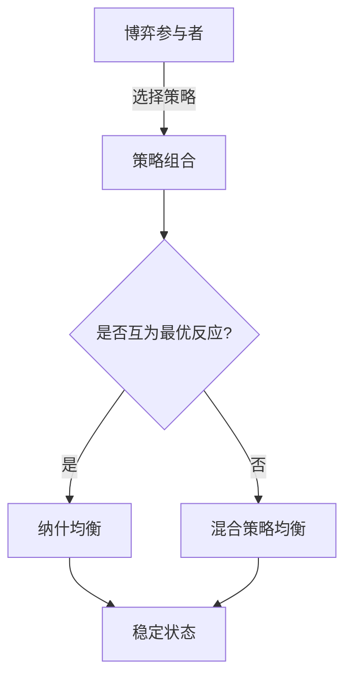

# 个人知识宇宙系统 (PKM Universe) 
## 产品需求文档 (PRD) v1.0

**版本**: 1.0  
**日期**: 2026-04-03  
**状态**: 开发就绪  
**目标**: 构建以动态评分系统为核心的个人知识管理系统

---

## 1. 产品概述

### 1.1 产品定位
一个以"我"为核心、高度结构化且动态演进的个人知识宇宙。通过三维动态评分系统（兴趣/战略/共识）驱动知识的相关度排序，实现知识的主动涌现而非被动检索。

### 1.2 核心差异化
- **动态评分引擎**: 知识价值随时间、行为、目标动态变化
- **三维评估体系**: 现在(兴趣) + 未来(战略) + 过去(共识)
- **Agent原生设计**: 优先支持AI Agent接口，自然语言交互
- **数据主权**: 本地优先，Markdown标准格式，完全可控

### 1.3 用户画像
- 知识工作者、终身学习者、研究者
- 需要管理跨学科复杂知识体系
- 希望AI辅助思考而非替代思考
- 重视数据隐私和长期可访问性

---

## 2. 系统架构

### 2.1 整体架构图

```
┌─────────────────────────────────────────────────────────────────┐
│                        接入层 (Access Layer)                     │
│  ┌──────────────┐  ┌──────────────┐  ┌──────────────────────┐   │
│  │   Obsidian   │  │   Web PWA    │  │   Agent/MCP Client   │   │
│  │   (桌面/移动) │  │  (浏览器)     │  │   (Claude/Cursor)    │   │
│  └──────┬───────┘  └──────┬───────┘  └──────────┬───────────┘   │
└─────────┼─────────────────┼─────────────────────┼───────────────┘
          │                 │                     │
          └─────────────────┼─────────────────────┘
                            │
┌───────────────────────────▼─────────────────────────────────────┐
│                      API 网关层 (API Gateway)                    │
│              FastAPI + Uvicorn + CORS + Rate Limit               │
│  路由: /api/v1/knowledge, /api/v1/score, /api/v1/graph, /mcp    │
└───────────────────────────┬─────────────────────────────────────┘
                            │
        ┌───────────────────┼───────────────────┐
        │                   │                   │
┌───────▼──────┐  ┌────────▼────────┐  ┌──────▼──────┐
│   业务逻辑层  │  │    评分引擎      │  │   索引服务   │
│  (Services)  │  │ (RelevanceEngine)│  │  (Indexer)  │
└───────┬──────┘  └────────┬────────┘  └──────┬──────┘
        │                   │                   │
        └───────────────────┼───────────────────┘
                            │
┌───────────────────────────▼─────────────────────────────────────┐
│                      数据持久化层 (Storage)                      │
│  ┌──────────────────────────────────────────────────────────┐   │
│  │              主存储: Obsidian Vault (Markdown)            │   │
│  │  路径: ~/PKM-Universe/                                    │   │
│  │  格式: YAML Frontmatter + Markdown Body + Mermaid脑图     │   │
│  └──────────────────────────────────────────────────────────┘   │
│  ┌──────────────────┐  ┌──────────────────┐  ┌──────────────┐   │
│  │   索引: SQLite   │  │  缓存: Local JSON│  │  向量: FAISS │   │
│  │   (fts5/tags)    │  │  (score cache)   │  │  (embeddings)│   │
│  └──────────────────┘  └──────────────────┘  └──────────────┘   │
└─────────────────────────────────────────────────────────────────┘
          │
          ▼
┌─────────────────────────────────────────────────────────────────┐
│                    同步与版本控制层                               │
│              Git (本地版本) + Syncthing/WebDAV (多端同步)        │
└─────────────────────────────────────────────────────────────────┘
```

### 2.2 技术栈选型

| 层级 | 技术 | 版本 | 选型理由 |
|------|------|------|----------|
| **后端框架** | FastAPI | ^0.104 | 异步支持、自动OpenAPI文档、Pydantic验证 |
| **数据库** | SQLite | 3.35+ | 零配置、FTS5全文搜索、Python原生支持 |
| **向量检索** | FAISS (CPU) | ^1.7 | Meta开源、本地运行、无需网络 |
| **嵌入模型** | sentence-transformers | ^2.2 | 本地推理、支持中文、可离线 |
| **文件监控** | watchdog | ^3.0 | 实时监控Vault文件变化 |
| **任务调度** | APScheduler | ^3.10 | 定时衰减计算、索引重建 |
| **MCP协议** | mcp-sdk | latest | Model Context Protocol官方SDK |
| **前端** | Vue3 + Vite + D3.js | latest | 响应式、轻量、图谱可视化强 |

---

## 3. 数据模型设计

### 3.1 核心实体关系图

```
┌──────────────────┐       ┌──────────────────┐       ┌──────────────────┐
│   Knowledge      │◄─────►│      Tag         │◄─────►│   Category       │
│   (知识原子)      │  M:N  │   (标签)          │  M:N  │   (分类/架构层)   │
└────────┬─────────┘       └──────────────────┘       └──────────────────┘
         │
         │ 1:N
         ▼
┌──────────────────┐       ┌──────────────────┐
│     Case         │◄─────►│   Reference      │
│   (案例标本)      │  双向  │   (双向引用)      │
└────────┬─────────┘       └──────────────────┘
         │
         │ 1:N
         ▼
┌──────────────────┐
│  ScoreHistory    │
│ (评分历史追踪)    │
└──────────────────┘
```

### 3.2 详细数据模型

#### 3.2.1 Knowledge (知识原子)

```python
class KnowledgeBase(BaseModel):
    """知识原子基础模型 - 对应Markdown文件"""

    # 标识
    id: str = Field(..., pattern=r"^know-[0-9]{6}$")
    title: str = Field(..., min_length=1, max_length=200)
    slug: str = Field(..., pattern=r"^[a-z0-9-]+$")  # URL友好标识

    # 内容
    content: str = Field(..., description="Markdown正文")
    brain_map: Optional[str] = Field(None, description="Mermaid脑图代码")
    summary: Optional[str] = Field(None, max_length=500, description="AI生成摘要")

    # 分类与标签
    category_path: List[str] = Field(..., description=["架构层", "学科系列", "数学"])
    tags: List[str] = Field(default=[], description=["#数学", "#意识系列"])

    # 评分系统 (核心)
    relevance_score: RelevanceScore

    # 关联
    linked_cases: List[str] = Field(default=[], description=["case-001", "case-002"])
    linked_knowledge: List[str] = Field(default=[], description=["know-002"])

    # 元数据
    source: Optional[SourceInfo] = None
    created_at: datetime
    updated_at: datetime
    accessed_at: Optional[datetime] = None  # 最后访问时间
    access_count: int = Field(default=0, ge=0)

    # 状态
    status: Literal["seed", "sprout", "mature", "archived"] = "seed"

class RelevanceScore(BaseModel):
    """三维评分模型"""
    interest_now: float = Field(..., ge=0, le=100, description="当前兴趣度")
    should_care_future: float = Field(..., ge=0, le=100, description="未来战略值")
    consensus_past: float = Field(..., ge=0, le=100, description="共识基础度")

    # 计算属性
    total: float = Field(..., ge=0, le=100, description="加权综合分")

    # 历史追踪
    history: List[ScoreRecord] = Field(default=[], max_length=100)

    # 权重配置 (可覆盖全局默认)
    weights: Optional[ScoreWeights] = None

class ScoreRecord(BaseModel):
    """单次评分记录"""
    timestamp: datetime
    dimension: Literal["interest_now", "should_care_future", "consensus_past", "total"]
    old_value: float
    new_value: float
    reason: str = Field(..., max_length=200)
    trigger: Literal["manual", "auto_decay", "access_boost", "application_boost", "agent_suggestion"]

class ScoreWeights(BaseModel):
    """评分权重"""
    interest_now: float = 0.4
    should_care_future: float = 0.35
    consensus_past: float = 0.25
```

#### 3.2.2 Case (案例标本)

```python
class Case(BaseModel):
    """实践案例模型"""

    id: str = Field(..., pattern=r"^case-[0-9]{6}$")
    title: str

    # 应用场景
    context: ApplicationContext

    # 内容
    content: str
    outcome: OutcomeInfo
    reflection: Optional[str] = None  # 事后复盘

    # 关联
    applied_knowledge: List[str] = Field(..., description="应用了哪些知识")
    tags: List[str] = []

    # 时间
    happened_at: datetime
    created_at: datetime

class ApplicationContext(BaseModel):
    """应用场景"""
    domain: str  # 领域：工作/学习/生活
    project: Optional[str] = None
    stakeholders: List[str] = []
    constraints: List[str] = []
```

#### 3.2.3 Log (日志与感悟)

```python
class LogEntry(BaseModel):
    """日志条目 - 时间切片"""

    id: str = Field(..., pattern=r"^log-[0-9]{8}-[0-9]{4}$")  # 日期+序号
    type: Literal["realtime", "short_term", "medium_term", "long_term"]

    content: str
    mood: Optional[str] = None
    energy_level: Optional[int] = Field(None, ge=1, le=10)

    # 关联
    related_knowledge: List[str] = []
    related_cases: List[str] = []

    timestamp: datetime
    location: Optional[str] = None

class Insight(BaseModel):
    """感悟/思想结晶"""

    id: str = Field(..., pattern=r"^ins-[0-9]{6}$")
    title: str
    content: str

    # 成熟度
    maturity: Literal["spark", "framework", "mature"] = "spark"

    # 衍生
    derived_from: List[str] = []  # 源自哪些知识/日志
    evolved_into: Optional[str] = None  # 演化为哪个成熟知识

    created_at: datetime
    refined_at: Optional[datetime] = None
```

### 3.3 文件存储格式 (Markdown + YAML Frontmatter)

**标准知识原子文件模板:**

```markdown
---
# 标识信息
id: "know-000001"
title: "博弈论基础：纳什均衡"
slug: "game-theory-nash-equilibrium"

# 架构分类
category: 
  - "学科系列"
  - "数学"
  - "博弈论"

# 标签系统
tags:
  - "#数学"
  - "#决策科学" 
  - "#意识系列"
  - "#战略思维"

# 三维评分 (核心)
relevance_score:
  interest_now: 85
  should_care_future: 92
  consensus_past: 78
  total: 85.3
  weights:  # 可选覆盖
    interest_now: 0.4
    should_care_future: 0.4
    consensus_past: 0.2
  history:
    - timestamp: "2026-01-15T10:00:00Z"
      dimension: "total"
      old_value: 0
      new_value: 80.0
      reason: "初始创建"
      trigger: "manual"
    - timestamp: "2026-03-20T14:30:00Z"
      dimension: "interest_now"
      old_value: 80
      new_value: 85
      reason: "成功应用于商务谈判"
      trigger: "application_boost"

# 双向关联
linked_cases:
  - "case-000015"
  - "case-000022"
linked_knowledge:
  - "know-000045"  # 囚徒困境
  - "know-000067"  # 拍卖理论

# 来源信息
source:
  type: "book"
  title: "策略思维"
  author: "阿维纳什·迪克西特"
  url: null
  accessed_at: "2026-01-10"

# 元数据
status: "mature"
created_at: "2026-01-15T10:00:00Z"
updated_at: "2026-03-20T14:30:00Z"
accessed_at: "2026-04-01T09:15:00Z"
access_count: 12

# 嵌入向量 (可选，用于语义检索)
embedding_model: "sentence-transformers/all-MiniLM-L6-v2"
embedding_vector: null  # 存储在SQLite中，不在Frontmatter
---

# 脑图 (高浓缩)



# 正文

## 核心定义
纳什均衡是指在一个博弈过程中，任何参与者单独改变策略都不会获得更好结果的策略组合。

## 数学表达
对于n人博弈，策略组合 $(s_1^*, s_2^*, ..., s_n^*)$ 是纳什均衡，当且仅当：

$$u_i(s_i^*, s_{-i}^*) \geq u_i(s_i, s_{-i}^*), \quad \forall s_i \in S_i, \forall i$$

## 关键洞察
1. **个体理性 ≠ 集体最优** (囚徒困境)
2. **均衡可能存在多个**
3. **混合策略扩展** - 随机化选择

## 应用场景
- 商务谈判中的出价策略
- 市场竞争中的定价决策  
- 人际关系中的互动模式

## 相关案例
- [[case-000015|与供应商的价格博弈]]
- [[case-000022|团队资源分配冲突解决]]

## 待探索
- [ ] 演化博弈论视角
- [ ] 量子博弈论前沿
```

---

## 4. 核心引擎：动态评分系统

### 4.1 评分算法规范

#### 4.1.1 综合分数计算

```python
class ScoringAlgorithm:
    """评分算法实现规范"""

    DEFAULT_WEIGHTS = {
        'interest_now': 0.40,
        'should_care_future': 0.35, 
        'consensus_past': 0.25
    }

    @staticmethod
    def calculate_total(score: RelevanceScore) -> float:
        """
        计算加权综合分

        公式: 
        total = interest_now * w1 + should_care_future * w2 + consensus_past * w3

        约束:
        - 结果四舍五入到1位小数
        - 范围严格限制在[0, 100]
        """
        weights = score.weights or ScoringAlgorithm.DEFAULT_WEIGHTS

        total = (
            score.interest_now * weights['interest_now'] +
            score.should_care_future * weights['should_care_future'] +
            score.consensus_past * weights['consensus_past']
        )

        return round(min(100, max(0, total)), 1)

    @staticmethod
    def apply_decay(score: RelevanceScore, days_inactive: int) -> float:
        """
        兴趣度自然衰减算法

        规则:
        - 衰减率: 每日2% (decay_rate = 0.98)
        - 只衰减 interest_now 维度
        - 最低不低于初始值的50% (防止完全遗忘重要知识)
        - 衰减记录写入history

        Args:
            days_inactive: 未访问天数

        Returns:
            新的interest_now值
        """
        decay_rate = 0.98
        min_floor = score.interest_now * 0.5

        new_value = score.interest_now * (decay_rate ** days_inactive)
        return max(min_floor, round(new_value, 1))

    @staticmethod
    def boost_for_access(score: RelevanceScore, access_depth: str) -> dict:
        """
        访问提升算法

        Args:
            access_depth: 访问深度
                - "glance": 浏览标题 (+0)
                - "read": 完整阅读 (+1)
                - "study": 深度学习，做笔记 (+3)
                - "apply": 实际应用 (+5)

        Returns:
            各维度调整值
        """
        boosts = {
            "glance": {"interest_now": 0, "consensus_past": 0.1},
            "read": {"interest_now": 1, "consensus_past": 0.5},
            "study": {"interest_now": 3, "consensus_past": 1},
            "apply": {"interest_now": 2, "should_care_future": 5, "consensus_past": 2}
        }
        return boosts.get(access_depth, {})
```

#### 4.1.2 自动评分触发器

| 触发条件 | 影响维度 | 调整值 | 冷却期 | 说明 |
|----------|----------|--------|--------|------|
| 被Agent引用 | consensus_past | +2 | 1天 | 知识被用于回答问题 |
| 创建关联链接 | interest_now | +1 | 7天 | 与其他知识建立连接 |
| 添加案例 | should_care_future | +3 | 无 | 理论被实践验证 |
| 30天未访问 | interest_now | -2%/天 | 无 | 自然衰减 |
| 手动标记重点 | interest_now | +10 | 无 | 人工干预优先 |
| 完成复习 | consensus_past | +2 | 7天 | 间隔重复系统 |

### 4.2 评分引擎服务接口

```python
class ScoreEngineService:
    """评分引擎服务 - 核心业务逻辑"""

    async def update_score(
        self, 
        knowledge_id: str,
        dimension: Literal["interest_now", "should_care_future", "consensus_past"],
        value: float,
        reason: str,
        trigger: str,
        user_id: str = "default"
    ) -> RelevanceScore:
        """
        更新单个维度评分

        业务规则:
        1. 验证value在[0, 100]范围内
        2. 记录历史变更
        3. 自动重新计算total
        4. 触发索引更新
        5. 写入Git变更日志
        """
        pass

    async def batch_decay_check(self):
        """
        批量衰减检查 - 定时任务

        执行逻辑:
        1. 查询所有accessed_at < 今天 - 7天的知识
        2. 计算每个知识的inactive天数
        3. 应用衰减公式
        4. 批量更新数据库
        5. 生成衰减报告
        """
        pass

    async def get_evolution_graph(
        self, 
        knowledge_id: str,
        days: int = 90
    ) -> List[ScoreRecord]:
        """
        获取认知演化图谱

        返回指定知识在N天内的评分变化轨迹
        用于可视化展示兴趣迁移
        """
        pass

    async def recalculate_all(self):
        """
        全库重新计算 - 权重调整时使用

        当用户修改全局权重时，重新计算所有知识的total分
        """
        pass
```

---

## 5. API 接口规范

### 5.1 RESTful API

#### 5.1.1 知识管理接口

```yaml
openapi: 3.0.0
info:
  title: PKM Universe API
  version: 1.0.0

paths:
  /api/v1/knowledge:
    get:
      summary: "动态查询知识"
      description: "核心查询接口，支持多维过滤和智能排序"
      parameters:
        - name: query
          in: query
          schema: { type: string }
          description: "自然语言查询（语义检索）"
        - name: min_score
          in: query
          schema: { type: number, default: 50 }
          description: "最低相关度分数"
        - name: tags
          in: query
          schema: { type: array, items: string }
          description: "标签过滤"
        - name: category
          in: query
          schema: { type: string }
          description: "分类路径，如'学科系列/数学'"
        - name: sort_by
          in: query
          schema: 
            type: string
            enum: [relevance, updated, created, accessed]
            default: relevance
        - name: sort_order
          in: query
          schema: { type: string, enum: [asc, desc], default: desc }
        - name: limit
          in: query
          schema: { type: integer, default: 20, maximum: 100 }
        - name: offset
          in: query
          schema: { type: integer, default: 0 }
      responses:
        200:
          description: "知识列表，按相关度排序"
          content:
            application/json:
              schema:
                type: object
                properties:
                  items: { type: array, items: { $ref: '#/components/schemas/Knowledge' } }
                  total: { type: integer }
                  facets:
                    type: object
                    properties:
                      score_distribution: { type: object }
                      top_tags: { type: array }

    post:
      summary: "创建知识原子"
      requestBody:
        content:
          application/json:
            schema:
              type: object
              required: [title, content]
              properties:
                title: { type: string }
                content: { type: string }
                brain_map: { type: string }
                category: { type: array, items: string }
                tags: { type: array, items: string }
                initial_scores:
                  type: object
                  properties:
                    interest_now: { type: number, default: 50 }
                    should_care_future: { type: number, default: 50 }
                    consensus_past: { type: number, default: 50 }
                source: { $ref: '#/components/schemas/SourceInfo' }
      responses:
        201:
          description: "创建成功，返回完整对象"
          headers:
            Location: 
              description: "新资源URL"
              schema: { type: string }

  /api/v1/knowledge/{id}:
    get:
      summary: "获取知识详情"
      parameters:
        - name: id
          in: path
          required: true
          schema: { type: string }
        - name: with_related
          in: query
          schema: { type: boolean, default: true }
          description: "是否包含关联知识/案例"
      responses:
        200:
          description: "知识详情"
          content:
            application/json:
              schema: { $ref: '#/components/schemas/Knowledge' }

    put:
      summary: "更新知识"
      requestBody:
        content:
          application/json:
            schema: { $ref: '#/components/schemas/KnowledgeUpdate' }

    delete:
      summary: "删除知识（软删除，移至archive）"

  /api/v1/knowledge/{id}/score:
    patch:
      summary: "调整评分"
      description: "核心接口，支持单维度调整和批量调整"
      requestBody:
        content:
          application/json:
            schema:
              oneOf:
                - type: object
                  properties:
                    dimension: { enum: [interest_now, should_care_future, consensus_past] }
                    value: { type: number }
                    reason: { type: string, maxLength: 200 }
                - type: object
                  properties:
                    adjustments:
                      type: array
                      items:
                        type: object
                        properties:
                          dimension: { type: string }
                          delta: { type: number }
                    reason: { type: string }
      responses:
        200:
          description: "更新后的评分对象"

  /api/v1/knowledge/{id}/related:
    get:
      summary: "获取关联推荐"
      description: "基于标签共现和语义相似度的推荐"
      parameters:
        - name: type
          in: query
          schema: { enum: [knowledge, case, all], default: all }
        - name: limit
          in: query
          schema: { type: integer, default: 5 }
      responses:
        200:
          description: "推荐列表，包含关联强度分数"

  /api/v1/graph/tags:
    get:
      summary: "获取标签关系图谱"
      description: "用于力导向图可视化"
      responses:
        200:
          content:
            application/json:
              schema:
                type: object
                properties:
                  nodes:
                    type: array
                    items:
                      type: object
                      properties:
                        id: { type: string }
                        name: { type: string }
                        count: { type: integer }
                        category: { type: string }
                  edges:
                    type: array
                    items:
                      type: object
                      properties:
                        source: { type: string }
                        target: { type: string }
                        weight: { type: number }

  /api/v1/graph/evolution:
    get:
      summary: "认知演化图谱"
      parameters:
        - name: days
          in: query
          schema: { type: integer, default: 90 }
        - name: top_n
          in: query
          schema: { type: integer, default: 10 }
          description: "只显示Top N知识的变化"
      responses:
        200:
          description: "时间序列数据，用于折线图"

  /api/v1/search:
    post:
      summary: "高级语义搜索"
      description: "结合向量相似度和评分权重的混合搜索"
      requestBody:
        content:
          application/json:
            schema:
              type: object
              properties:
                query: { type: string }
                semantic_weight: { type: number, default: 0.6 }
                score_weight: { type: number, default: 0.4 }
                filters:
                  type: object
                  properties:
                    tags: { type: array }
                    date_range: { type: object }
      responses:
        200:
          description: "搜索结果，包含匹配分数和片段高亮"
```

### 5.2 MCP (Model Context Protocol) 接口

专为AI Agent设计的协议接口，支持Claude、Cursor等工具直接调用。

```python
# MCP Server 实现规范

class PKMMCPService:
    """MCP协议服务实现"""

    @mcp.tool()
    async def knowledge_query(
        query: str,
        context: str = "general",
        top_k: int = 5,
        min_relevance: float = 60.0
    ) -> str:
        """
        查询个人知识库

        这是Agent的主要入口。系统会：
        1. 将query转为向量
        2. 检索相似知识
        3. 用个人评分加权排序
        4. 组装上下文返回

        Args:
            query: 自然语言查询，如"我最近对决策科学感兴趣的内容"
            context: 当前任务上下文，用于调整权重
            top_k: 返回数量
            min_relevance: 最低相关度门槛

        Returns:
            格式化的知识摘要，包含来源和评分
        """
        pass

    @mcp.tool()
    async def knowledge_create(
        title: str,
        content: str,
        brain_map: Optional[str] = None,
        auto_categorize: bool = True,
        suggested_scores: Optional[dict] = None
    ) -> dict:
        """
        创建新知识原子

        Agent可以在对话中直接帮用户记录知识。
        系统会自动：
        - 提取关键词生成标签
        - 建议分类路径
        - 初始化评分（基于当前对话上下文）
        """
        pass

    @mcp.tool()
    async def score_suggest(
        knowledge_id: str,
        current_context: str
    ) -> dict:
        """
        智能评分建议

        基于知识的使用频率、关联度、时效性，
        Agent建议新的评分，由用户确认。
        """
        pass

    @mcp.tool()
    async def get_insight_summary(
        days: int = 7,
        focus_area: Optional[str] = None
    ) -> str:
        """
        生成认知摘要

        总结最近N天的：
        - 评分变化最大的知识
        - 新增的高价值内容
        - 被遗忘但重要的知识（评分衰减提醒）
        """
        pass

    @mcp.resource("pkm://stats/daily")
    async def daily_stats(self) -> str:
        """每日统计，可被Agent主动读取"""
        pass
```

---

## 6. 存储与索引设计

### 6.1 SQLite 数据库Schema

```sql
-- 主表：知识原子
CREATE TABLE knowledge (
    id TEXT PRIMARY KEY,
    title TEXT NOT NULL,
    slug TEXT UNIQUE NOT NULL,
    content TEXT NOT NULL,
    brain_map TEXT,
    summary TEXT,
    category_path TEXT,  -- JSON数组
    tags TEXT,  -- JSON数组

    -- 评分字段
    score_interest_now REAL DEFAULT 50,
    score_should_care_future REAL DEFAULT 50,
    score_consensus_past REAL DEFAULT 50,
    score_total REAL GENERATED ALWAYS AS (
        score_interest_now * 0.4 + 
        score_should_care_future * 0.35 + 
        score_consensus_past * 0.25
    ) STORED,

    -- 关联
    linked_cases TEXT,  -- JSON数组
    linked_knowledge TEXT,  -- JSON数组

    -- 元数据
    source_type TEXT,
    source_title TEXT,
    source_url TEXT,
    status TEXT DEFAULT 'seed',

    -- 时间戳
    created_at TIMESTAMP DEFAULT CURRENT_TIMESTAMP,
    updated_at TIMESTAMP DEFAULT CURRENT_TIMESTAMP,
    accessed_at TIMESTAMP,
    access_count INTEGER DEFAULT 0,

    -- 全文搜索虚拟表关联
    fts_doc_id INTEGER
);

-- 评分历史表
CREATE TABLE score_history (
    id INTEGER PRIMARY KEY AUTOINCREMENT,
    knowledge_id TEXT NOT NULL,
    timestamp TIMESTAMP DEFAULT CURRENT_TIMESTAMP,
    dimension TEXT NOT NULL,  -- interest_now, should_care_future, consensus_past
    old_value REAL NOT NULL,
    new_value REAL NOT NULL,
    reason TEXT,
    trigger_type TEXT,
    FOREIGN KEY (knowledge_id) REFERENCES knowledge(id)
);

-- 案例表
CREATE TABLE cases (
    id TEXT PRIMARY KEY,
    title TEXT NOT NULL,
    content TEXT NOT NULL,
    context_domain TEXT,
    context_project TEXT,
    outcome_result TEXT,
    outcome_lessons TEXT,
    applied_knowledge TEXT,  -- JSON数组
    tags TEXT,
    happened_at TIMESTAMP,
    created_at TIMESTAMP DEFAULT CURRENT_TIMESTAMP
);

-- 日志表
CREATE TABLE logs (
    id TEXT PRIMARY KEY,
    type TEXT NOT NULL,  -- realtime, short_term, medium_term, long_term
    content TEXT NOT NULL,
    mood TEXT,
    energy_level INTEGER,
    related_knowledge TEXT,  -- JSON数组
    related_cases TEXT,
    timestamp TIMESTAMP DEFAULT CURRENT_TIMESTAMP,
    location TEXT
);

-- 标签本体表（用于图谱）
CREATE TABLE tags (
    id TEXT PRIMARY KEY,
    name TEXT UNIQUE NOT NULL,
    category TEXT,  -- 属于哪个架构层
    description TEXT,
    parent_tag TEXT,
    usage_count INTEGER DEFAULT 0,
    created_at TIMESTAMP DEFAULT CURRENT_TIMESTAMP
);

-- 标签关系表（共现关系）
CREATE TABLE tag_relations (
    tag1 TEXT NOT NULL,
    tag2 TEXT NOT NULL,
    co_occurrence_count INTEGER DEFAULT 1,
    strength REAL GENERATED ALWAYS AS (
        MIN(co_occurrence_count / 10.0, 1.0)
    ) STORED,
    PRIMARY KEY (tag1, tag2),
    FOREIGN KEY (tag1) REFERENCES tags(id),
    FOREIGN KEY (tag2) REFERENCES tags(id)
);

-- 向量索引表 (FAISS辅助)
CREATE TABLE embeddings (
    knowledge_id TEXT PRIMARY KEY,
    vector BLOB NOT NULL,  -- 序列化的向量
    model_name TEXT NOT NULL,
    updated_at TIMESTAMP DEFAULT CURRENT_TIMESTAMP,
    FOREIGN KEY (knowledge_id) REFERENCES knowledge(id)
);

-- 全文搜索虚拟表
CREATE VIRTUAL TABLE knowledge_fts USING fts5(
    title,
    content,
    summary,
    tags,
    content='knowledge',
    content_rowid='rowid'
);

-- 触发器：保持FTS索引同步
CREATE TRIGGER knowledge_ai AFTER INSERT ON knowledge BEGIN
    INSERT INTO knowledge_fts(rowid, title, content, summary, tags)
    VALUES (new.rowid, new.title, new.content, new.summary, new.tags);
END;

CREATE TRIGGER knowledge_ad AFTER DELETE ON knowledge BEGIN
    INSERT INTO knowledge_fts(knowledge_fts, rowid, title, content, summary, tags)
    VALUES ('delete', old.rowid, old.title, old.content, old.summary, old.tags);
END;

CREATE TRIGGER knowledge_au AFTER UPDATE ON knowledge BEGIN
    INSERT INTO knowledge_fts(knowledge_fts, rowid, title, content, summary, tags)
    VALUES ('delete', old.rowid, old.title, old.content, old.summary, old.tags);
    INSERT INTO knowledge_fts(rowid, title, content, summary, tags)
    VALUES (new.rowid, new.title, new.content, new.summary, new.tags);
END;

-- 索引优化
CREATE INDEX idx_knowledge_score ON knowledge(score_total DESC);
CREATE INDEX idx_knowledge_category ON knowledge(category_path);
CREATE INDEX idx_knowledge_accessed ON knowledge(accessed_at DESC);
CREATE INDEX idx_score_history_kid ON score_history(knowledge_id, timestamp);
CREATE INDEX idx_logs_timestamp ON logs(timestamp DESC);
CREATE INDEX idx_logs_type ON logs(type, timestamp);
```

### 6.2 文件系统监控

```python
class VaultWatcher:
    """
    监控Obsidian Vault文件变化，实时同步到数据库

    监控路径: ~/PKM-Universe/
    事件类型: 
        - 创建: 解析Markdown，插入数据库
        - 修改: 对比Frontmatter，更新变更字段
        - 删除: 标记为archived，不物理删除
        - 重命名: 更新slug和文件路径
    """

    def __init__(self, vault_path: str, db: Database):
        self.vault = Path(vault_path)
        self.db = db
        self.observer = Observer()

    def on_file_created(self, event):
        """新文件创建事件"""
        if event.src_path.endswith('.md'):
            knowledge = self.parse_markdown(event.src_path)
            self.db.insert_knowledge(knowledge)
            self.update_search_index(knowledge)

    def on_file_modified(self, event):
        """文件修改事件"""
        # 对比hash，避免重复处理
        # 解析Frontmatter变更
        # 增量更新数据库
        pass

    def parse_markdown(self, file_path: str) -> Knowledge:
        """
        解析Markdown文件为标准模型

        步骤:
        1. 读取文件内容
        2. 用python-frontmatter解析YAML
        3. 验证schema
        4. 提取正文和脑图
        5. 生成向量嵌入
        """
        pass
```

---

## 7. 前端界面设计

### 7.1 功能模块

| 模块 | 优先级 | 描述 |
|------|--------|------|
 **引力场视图** | P0 | D3.js力导向图，节点大小=评分，颜色=分类 |
| **时间轴视图** | P0 | 认知演化轨迹，可筛选维度 |
| **列表视图** | P0 | 可排序、可过滤的知识列表 |
| **编辑器** | P1 | Markdown编辑器，支持Mermaid实时预览 |
| **评分面板** | P1 | 三维度滑块调整，历史曲线 |
| **Agent对话** | P1 | 集成MCP客户端，自然语言交互 |
| **统计仪表盘** | P2 | 知识增长曲线、标签分布、评分分布 |

### 7.2 关键界面原型

**引力场视图 (Gravity Field)**
```
┌─────────────────────────────────────────────────────────────┐
│  [筛选: 全部 ▼]  [搜索...]          [列表视图] [时间轴] [设置]│
├─────────────────────────────────────────────────────────────┤
│                                                             │
│     ○ 博弈论 (85)                                           │
│      ╲                                                      │
│       ○───○ 纳什均衡 (92)  ←── 鼠标悬停显示详情卡片          │
│      ╱      ╲                                               │
│  ○──┘        ○ 囚徒困境 (78)                                 │
│ 机器学习                                                    │
│                                                             │
│  图例: ● 学科系列  ○ 分支系列  △ 案例                        │
│  大小 = 相关度评分  连线粗细 = 关联强度                       │
│                                                             │
│  [力导向模拟: 开启]  [聚类: 按标签]  [重置视图]               │
└─────────────────────────────────────────────────────────────┘
```

**评分调整面板**
```
┌────────────────────────────────────────┐
│ 调整评分: 博弈论基础                    │
├────────────────────────────────────────┤
│                                        │
│ 当前综合分: 85.3  [历史曲线 📈]         │
│                                        │
│ 当前兴趣度 (40%)                       │
│ [────●────────────] 85                 │
│ 上次调整: 3天前 (+5，应用于商务谈判)     │
│                                        │
│ 战略价值 (35%)                         │
│ [──────────●──────] 92                 │
│ 趋势: ↑ 上升 (近期多次应用)             │
│                                        │
│ 共识基础 (25%)                         │
│ [──────●──────────] 78                 │
│ 建议: 与"决策科学"建立更多链接可提升      │
│                                        │
│ 调整原因: [________________]           │
│                                        │
│ [取消]              [保存并记录]        │
└────────────────────────────────────────┘
```

---

## 8. 部署与运维

### 8.1 本地部署架构

```yaml
# docker-compose.yml (可选，用于完整环境隔离)
version: '3.8'
services:
  pkm-api:
    build: ./api
    volumes:
      - ~/PKM-Universe:/data/vault:rw
      - ./data:/data/db:rw
    ports:
      - "8000:8000"
    environment:
      - VAULT_PATH=/data/vault
      - DB_PATH=/data/db/pkm.db
      - EMBEDDING_MODEL=sentence-transformers/all-MiniLM-L6-v2

  pkm-web:
    build: ./web
    ports:
      - "3000:80"
    environment:
      - API_URL=http://localhost:8000
```

### 8.2 定时任务配置

```python
# APScheduler 配置
SCHEDULED_JOBS = {
    # 每日凌晨2点执行兴趣衰减
    'decay_interest': {
        'trigger': 'cron',
        'hour': 2,
        'minute': 0,
        'func': 'jobs:apply_daily_decay'
    },

    # 每周一早上8点生成周回顾
    'weekly_review': {
        'trigger': 'cron',
        'day_of_week': 'mon',
        'hour': 8,
        'minute': 0,
        'func': 'jobs:generate_weekly_insight'
    },

    # 每小时重建增量索引
    'index_update': {
        'trigger': 'interval',
        'hours': 1,
        'func': 'jobs:update_search_index'
    },

    # 每日Git自动提交
    'git_backup': {
        'trigger': 'cron',
        'hour': 23,
        'minute': 30,
        'func': 'jobs:auto_git_commit'
    }
}
```

### 8.3 备份策略

| 层级 | 频率 | 方式 | 保留策略 |
|------|------|------|----------|
| **Git提交** | 每日自动 + 手动 | Git本地 + 远程Push | 永久保留 |
| **SQLite备份** | 每日 | 导出为SQL + 压缩 | 30天滚动 |
| **向量索引** | 每周 | FAISS索引文件备份 | 与SQLite同步 |
| **完整快照** | 每月 | rsync到外部硬盘 | 12个月滚动 |

---

## 9. 开发路线图

### Phase 1: 基础架构 (Week 1-2)
- [ ] 搭建FastAPI项目骨架
- [ ] 实现Markdown解析器（Frontmatter提取）
- [ ] 设计SQLite Schema并初始化
- [ ] 实现文件系统监控（watchdog）
- [ ] 基础CRUD API

### Phase 2: 评分引擎 (Week 3-4)
- [ ] 实现三维评分计算算法
- [ ] 评分历史记录系统
- [ ] 衰减算法和定时任务
- [ ] 评分调整API和冲突解决
- [ ] 评分历史可视化数据接口

### Phase 3: 智能检索 (Week 5-6)
- [ ] 集成sentence-transformers
- [ ] 实现向量索引（FAISS）
- [ ] 混合检索算法（语义+评分）
- [ ] 全文搜索优化（FTS5）
- [ ] 搜索结果高亮和片段提取

### Phase 4: Agent集成 (Week 7-8)
- [ ] 实现MCP Server规范
- [ ] knowledge_query工具
- [ ] knowledge_create工具
- [ ] score_suggest智能建议
- [ ] 与Claude/Cursor联调测试

### Phase 5: 前端界面 (Week 9-10)
- [ ] Vue3项目搭建
- [ ] 引力场D3.js可视化
- [ ] 评分调整面板
- [ ] 时间轴视图
- [ ] PWA适配移动端

### Phase 6: 优化与生态 (Week 11-12)
- [ ] 性能优化（查询<100ms）
- [ ] 数据迁移工具
- [ ] 导入导出功能（Notion/Obsidian兼容）
- [ ] 文档完善
- [ ] 开源发布准备

---

## 10. 风险与应对

| 风险 | 可能性 | 影响 | 应对策略 |
|------|--------|------|----------|
 **数据丢失** | 低 | 极高 | Git版本控制 + 3-2-1备份策略 |
| **性能瓶颈** | 中 | 高 | SQLite索引优化 + 向量缓存 + 分页加载 |
| **评分算法失效** | 中 | 中 | 保留手动覆盖权 + A/B测试不同权重 |
| **移动端体验差** | 中 | 中 | PWA离线优先 + Obsidian原生App备用 |
| **Agent接口变更** | 高 | 中 | 封装适配层，隔离MCP协议细节 |
| **概念过于复杂** | 中 | 高 | 提供"简单模式"，隐藏评分细节 |

---

## 11. 附录

### 11.1 命名规范

| 类型 | 格式 | 示例 |
|------|------|------|
| 知识ID | `know-[6位数字]` | know-000042 |
| 案例ID | `case-[6位数字]` | case-000015 |
| 日志ID | `log-[YYYYMMDD]-[4位序号]` | log-20260403-0001 |
| 感悟ID | `ins-[6位数字]` | ins-000007 |
| 标签 | `#[中文名]` | #数学, #意识系列 |
| 分类路径 | `系列/学科/分支` | 学科系列/数学/博弈论 |
| 文件名 | `[slug].md` | game-theory-nash-equilibrium.md |

### 11.2 参考资源

- **Obsidian**: https://obsidian.md
- **MCP Protocol**: https://modelcontextprotocol.io
- **FastAPI**: https://fastapi.tiangolo.com
- **FAISS**: https://github.com/facebookresearch/faiss
- **D3.js Force**: https://d3js.org/d3-force

---

**文档结束**

**维护记录:**
- v1.0 (2026-04-03): 初始版本，完整PRD
