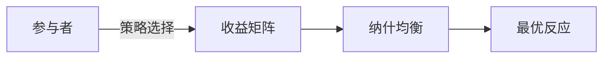

# PKM 个人知识宇宙 — 架构设计原案

> 这是 PRD v1.0（PKM Universe）形成之前的最后一个过程文件，包含完整的架构设计思路、数据层选型、评分算法、API设计和实施路线图。

**作者：** 贾玉冰  
**日期：** 2026-04-03（PRD 形成前）  
**状态：** 过程文档归档

---

## 一、持久化数据层选型

**推荐方案：Obsidian + 本地Git + 可选云端同步**

| 维度 | Obsidian | Notion | MySQL |
|------|----------|--------|-------|
| 文件所有权 | ✅ 本地Markdown，完全拥有 | ❌ 云端锁定，导出受限 | ✅ 自主托管 |
| Agent友好度 | ✅ 极高，纯文本易解析 | ⚠️ API限流，格式封闭 | ✅ 结构化查询强 |
| 动态评分系统 | ⚠️ 需插件/外部脚本 | ❌ 难以实现复杂算法 | ✅ 天然适合 |
| 移动体验 | ✅ 官方App优秀 | ✅ 优秀 | ❌ 需自建前端 |
| 离线能力 | ✅ 完全离线 | ❌ 依赖网络 | ✅ 可本地部署 |
| 版本控制 | ✅ Git完美支持 | ❌ 历史记录有限 | ✅ 完备 |

**最终架构：混合模式**

```
核心数据层：Obsidian Vault（Markdown + YAML Frontmatter）
索引加速层：SQLite/JSON（动态评分、标签图谱缓存）
版本控制：Git + GitHub/GitLab
可选云端：iCloud/OneDrive/自托管Syncthing
```

**文件结构示例：**

```
📁 PKM-Universe/
├── 📁 01-架构层/
│   ├── 📁 基石系列/
│   │   ├── 时间系列.md
│   │   ├── 空间系列.md
│   │   └── 意识系列.md
│   ├── 📁 学科系列/
│   └── 📁 分支系列/
├── 📁 02-内容层/
│   ├── 📁 知识层（原子）/
│   │   └── 博弈论.md ← 包含YAML元数据和双向链接
│   └── 📁 案例层（标本）/
│       └── 纳什均衡在商业谈判中的应用.md
├── 📁 03-轨迹层/
│   ├── 📁 日志层/
│   └── 📁 感悟层/
├── 📁 99-系统/
│   ├── 评分引擎配置.yml
│   └── 标签本体.json
└── 📄 .obsidian/ ← Obsidian配置
```

---

## 二、单个知识原子文件格式

```markdown
---
id: "know-2024-001"
title: "博弈论基础"
tags: ["#社会学", "#数学", "#意识系列", "#决策科学"]
category: ["学科系列/数学", "分支系列/博弈论"]
relevance_score:
  interest_now: 85       # 当前兴趣
  should_care_future: 90 # 战略价值 
  consensus_past: 75     # 基础共识
  total: 83.3            # 加权综合（自动计算）
  history:
    - date: 2024-01-15
      score: 80
      reason: "初学"
    - date: 2024-03-20 
      score: 83.3
      reason: "应用于商务谈判"
created: 2024-01-15
updated: 2024-03-20
linked_cases:
  - "case-2024-015"
  - "case-2024-022"
---

## 脑图（高浓缩）



正文
...
```

---

## 三、操作层架构设计

### 3.1 核心引擎：动态评分系统

**算法设计：**

```python
class RelevanceEngine:
  def __init__(self):
    self.weights = {
      'interest_now': 0.4,        # 当下热情权重最高
      'should_care_future': 0.35, # 战略价值次高
      'consensus_past': 0.25      # 基础共识保底
    }
  
  def calculate_score(self, item: dict) -> float:
    """计算综合相关度分数"""
    scores = [
      item['relevance_score']['interest_now'] * self.weights['interest_now'],
      item['relevance_score']['should_care_future'] * self.weights['should_care_future'],
      item['relevance_score']['consensus_past'] * self.weights['consensus_past']
    ]
    return round(sum(scores), 1)
  
  def decay_interest(self, item: dict, days_inactive: int):
    """兴趣自然衰减（如果长期未接触）"""
    decay_rate = 0.98  # 每日衰减2%
    item['relevance_score']['interest_now'] *= (decay_rate ** days_inactive)
  
  def boost_for_application(self, item: dict, context: str):
    """实际应用后提升战略价值分"""
    if "成功应用" in context:
      item['relevance_score']['should_care_future'] = min(
        100, 
        item['relevance_score']['should_care_future'] + 5
      )
```

### 3.2 API设计（Agent优先）

**RESTful + GraphQL 混合接口：**

```yaml
paths:
  /knowledge:
    get:
      summary: "动态查询知识原子"
      parameters:
        - name: min_score
          schema: { type: number, default: 70 }
        - name: tag_filter
          schema: { type: array }
        - name: sort_by
          enum: [relevance, updated, created]
      responses:
        200:
          description: "按相关度排序的知识列表"
  
  /graph/tags:
    get:
      summary: "获取标签关系图谱（力导向图数据）"
  
  /score/update:
    post:
      summary: "批量更新评分"
      requestBody:
        schema:
          type: array
          items:
            properties:
              id: string
              dimension: enum [interest_now, should_care_future, consensus_past]
              value: number (0-100)
              reason: string
```

**Agent专用接口（MCP协议风格）：**

```python
tools = [
  {
    "name": "knowledge_query",
    "description": "查询个人知识库，自动按相关度排序",
    "parameters": {
      "query": "string",          # 自然语言查询
      "context": "current_task", # 当前任务上下文
      "top_k": 5,                # 返回数量
      "recency_bias": 0.3        # 时间衰减系数
    }
  },
  {
    "name": "knowledge_create",
    "description": "创建新知识原子",
    "parameters": {
      "title": "string",
      "content": "string",
      "brain_map": "mermaid_code",
      "auto_tag": true,
      "link_to": ["existing_id"]
    }
  },
  {
    "name": "score_adjust",
    "description": "调整知识相关度评分",
    "parameters": {
      "id": "string",
      "dimension": "enum",
      "delta": "number",
      "reason": "string"
    }
  }
]
```

### 3.3 读写与维护流程

```
写入流程（Create）
  1. 捕获（Capture） → 快速记录到「实时日志」 inbox.md
  2. 蒸馏（Distill） → 定期整理为「知识原子」或「感悟」
  3. 关联（Connect） → AI辅助打标签，建立双向链接
  4. 评分（Score） → 初始化三维评分，加入评分队列
  5. 固化（Solidify）→ 生成永久Markdown文件，Git提交

读取流程（Read）
  场景A：主动探索
    → 按评分排序浏览 / 标签图谱导航 / 时间线回溯
  场景B：Agent辅助（推荐主力）
    → 自然语言查询 → 语义检索 + 评分加权 → 上下文组装
    → 示例："我最近对意识系列感兴趣，推荐3个高相关度知识"
  场景C：被动推送
    → 每日/每周生成「认知摘要」：评分变化Top5、待复习知识

更新维护（Update）
  定期任务（Cron）：
    - 每日：兴趣衰减计算（未接触知识 -2%）
    - 每周：评分历史归档，生成认知演化图谱
    - 每月：人工Review高分知识，调整战略权重
  触发式更新：
    - 当知识被引用时 → 提升consensus_past
    - 当成功应用后 → 提升should_care_future + 记录案例
    - 当主动学习时 → 提升interest_now
```

### 3.4 性能与并发设计

| 层面 | 策略 |
|------|------|
| 本地索引 | SQLite FTS5全文索引 + 标签倒排索引 |
| 缓存层 | 评分结果缓存（本地JSON），5分钟TTL |
| 并发控制 | 文件级锁（flock），避免同时编辑同一文件 |
| 版本管理 | Git自动提交（每日diff），冲突时生成分支人工合并 |
| 网络同步 | Syncthing（P2P）或WebDAV，冲突文件自动重命名保留 |

---

## 四、UI形态与接入方案

### 4.1 多端策略

| 端 | 方案 | 核心功能 |
|----|------|---------|
| 桌面 | Obsidian原生 + 自定义插件 | 完整功能：编辑、图谱、评分调整 |
| 手机 | Obsidian Mobile + 快捷指令 | 快速捕获（语音/拍照→转文字→inbox） |
| 浏览器 | 本地Web服务（FastAPI）+ PWA | 轻量查询、评分调整、图谱浏览 |
| Agent | MCP Server / HTTP API | 语义检索、自动评分、知识生成 |

### 4.2 Agent深度集成（重点）

```python
class PKMServer:
  def __init__(self, vault_path: str):
    self.vault = ObsidianVault(vault_path)
    self.engine = RelevanceEngine()
    self.embeddings = LocalEmbeddings()  # 本地向量模型
  
  async def query(self, request: QueryRequest):
    """
    Agent查询示例：
    "我正在写一篇关于决策偏差的文章，
    请从我的知识库中找到相关理论，并按实用程度排序"
    """
    # 1. 语义检索（向量相似度）
    semantic_hits = self.embeddings.search(request.query, top_k=20)
    
    # 2. 评分加权（个人相关度）
    scored_results = []
    for hit in semantic_hits:
      item = self.vault.get(hit.id)
      personal_score = self.engine.get_effective_score(item)
      final_score = hit.similarity * 0.6 + personal_score * 0.4
      scored_results.append((item, final_score))
    
    # 3. 上下文组装（自动提取脑图+关键段落）
    return self.assemble_context(scored_results[:request.top_k])
  
  async def learn_from_interaction(self, interaction: InteractionLog):
    if interaction.type == "引用知识":
      self.engine.adjust_score(
        interaction.knowledge_id,
        dimension="consensus_past",
        delta=+2,
        reason=f"被Agent引用用于{interaction.task}"
      )
```

---

## 五、实施路线图

```
Phase 1（1-2周）：基础架构
  ├─ 搭建Obsidian Vault结构
  ├─ 设计YAML Frontmatter模板
  └─ 配置Git版本控制

Phase 2（2-3周）：评分引擎
  ├─ 开发Python评分计算脚本
  ├─ 实现历史追踪（JSON/CSV）
  └─ 集成Obsidian插件（DataviewJS展示分数）

Phase 3（3-4周）：Agent接口
  ├─ 搭建FastAPI服务
  ├─ 实现语义检索（本地嵌入模型）
  └─ 开发MCP Server供Claude/Cursor使用

Phase 4（持续）：智能增强
  ├─ 自动标签生成（LLM）
  ├─ 知识关联推荐（图算法）
  └─ 认知演化可视化（D3.js）
```

---

## 六、关键决策建议

1. **数据主权优先：** 选择Obsidian而非Notion，确保50年后仍能打开你的知识库
2. **Agent优先设计：** 未来的主要交互方式将是自然语言对话，而非手动点击
3. **评分是灵魂：** 三维评分系统是这个架构区别于普通笔记软件的核心竞争力，务必保持手动调整权（AI建议，人类决策）
4. **渐进式复杂：** 从简单的Markdown+标签开始，逐步添加评分、图谱、Agent能力
