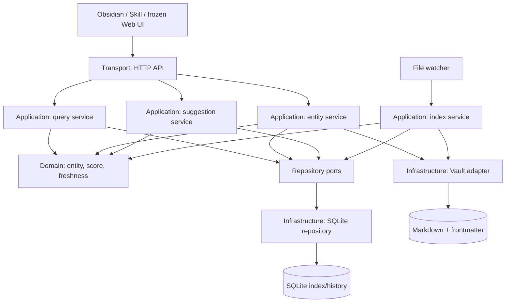

# Compass Architecture Design

> Version: v1.0 | Date: 2026-07-11 | Status: target architecture for Phase 5
>
> This document bridges the product requirements and implementation plan. It defines the module boundaries, dependency direction, data ownership, runtime flows, and migration acceptance criteria for Compass v3.

## 1. Document Roles

| Document | Owns | Does not own |
|---|---|---|
| `PRD_v3.0.md` | Product intent, user-facing behavior, data ownership, non-goals | Rust module layout or refactoring steps |
| `ARCHITECTURE.md` | Boundaries, dependency rules, data flow, interface contracts, target structure | Individual task estimates or test cases |
| `TEST_CASES.md` | v3 acceptance scenarios, test levels, and regression cases | Architectural alternatives or task order |
| `PLAN.md` | Phase order, deliverables, dependencies, acceptance | Architectural alternatives or test implementation detail |
| `GITHUB_WORKFLOW.md` | Issue, branch, local verification, PR review, merge, and closure flow | Product, architecture, or test contracts |
| Automated tests | Executable behavior and regression protection | Architecture decisions |

The required document flow is `PRD -> ARCHITECTURE -> TEST_CASES -> PLAN -> GITHUB_WORKFLOW`. When documents conflict, the PRD wins on product intent, this document wins on implementation boundaries, and the PLAN must be updated to match both.

## 2. Architectural Drivers

1. Markdown frontmatter in the Vault is authoritative. SQLite is a rebuildable index, cache, and history store.
2. The three-dimensional base score is stable data. Freshness is a read-time calculation and must never be persisted as a time-driven score change.
3. Obsidian and Agent/Skill are the active interaction surfaces. The existing static Web UI is retained for compatibility but frozen and will eventually be extracted as an optional component.
4. The process remains one Rust binary. External Agent, Skill, and Feishu infrastructure communicate through the HTTP contract and do not become Compass internals.
5. File I/O, SQLite operations, HTTP serialization, and score rules must not be coupled in one module or one lock scope.

## 3. Target Boundary Map



### 3.1 Layers and Responsibilities

| Layer | Responsibility | May depend on | Must not depend on |
|---|---|---|---|
| Transport | Axum routes, auth, HTTP request/response DTOs, status-to-error mapping | Application interfaces | `rusqlite`, frontmatter parsing, SQL row types |
| Application | Use-case orchestration: query, create, score, access, suggestions, weekly report, indexing | Domain and repository/Vault ports | Axum types, SQL details, `EntityRow` |
| Domain | Entity concepts, score calculation, freshness rules, validation, stable identifiers | Rust standard library and small value dependencies | HTTP, files, SQLite, Tokio |
| Infrastructure | SQLite repository, Vault/Markdown adapter, file watcher adapter | Domain types and application ports | HTTP DTOs or route logic |
| Composition root | Configuration, concrete dependency creation, server/watcher startup | All layers | Business rules |

`main.rs` is the composition root. It is the only place allowed to choose `SqliteRepository`, `VaultAdapter`, the watcher implementation, and the HTTP server together.

### 3.2 Dependency Rules

- Dependencies point inward: Transport and Infrastructure depend on Application/Domain; Domain depends on neither outer layer.
- Application code receives repository and Vault traits/ports, not `Db`, `Connection`, `PathBuf`, or Axum extractors.
- `EntityRow`, `SuggestionRow`, SQL statements, and FTS snippets are private to the SQLite infrastructure module.
- HTTP request/response structs are private to Transport. Application services return domain values or application result models.
- Frontmatter parsing and atomic file writes are private to the Vault adapter. Other layers request `load`, `write_score`, `patch_metadata`, or `scan` behavior through its port.

## 4. Data Model Ownership

| Concept | Owner | Persistence / representation |
|---|---|---|
| `Entity`, `Score`, `Freshness`, `EffectiveScore`, IDs and score rules | Domain | Pure Rust values |
| Markdown note, frontmatter parsing, content hash, atomic write | Vault adapter | Vault files |
| Index projection, FTS content, suggestions cache, history/timeline rows | SQLite repository | SQLite only |
| Create/score/access/tag/related request and JSON response shapes | HTTP transport | HTTP JSON only |

The Vault write path is authoritative: update frontmatter first, then update the derived SQLite index and history. If the index update fails after a successful Vault write, return an error and let watcher/rebuild reconcile the cache; never roll back the Vault by reconstructing old content from SQLite.

## 5. Runtime Flows

### 5.1 Read Query

1. The HTTP route validates and converts a request DTO into an application command.
2. The query service requests an index snapshot from the repository, then releases the SQLite lock.
3. The service calculates `effective_composite` from base score, `content_updated_at`, freshness, and the injected current time.
4. Sorting, filtering, and response projection run after the lock is released.
5. The transport layer serializes the application result into its HTTP DTO.

### 5.2 Authoritative Write

1. The HTTP route converts the request into an application command.
2. The entity service loads the Vault note and validates the domain change.
3. The Vault adapter atomically writes the new frontmatter.
4. The service derives an index projection and updates SQLite plus history in a short repository transaction.
5. A watcher event is idempotent reconciliation, not a competing source of truth.

### 5.3 Rebuild and File Watcher

1. The index service scans and parses Vault files outside the SQLite lock.
2. It produces validated domain entities and index projections in memory.
3. The SQLite repository replaces index projections and FTS data in one short transaction.
4. The watcher invokes the same indexing service for a changed path, so rebuild and incremental indexing share parsing and projection rules.

## 6. Concurrency and Failure Rules

- A SQLite mutex guards only synchronous repository calls. No `MutexGuard` may cover file reads, parsing, score calculation, sorting, HTTP serialization, or an `.await`.
- Rebuild scanning is intentionally outside the database transaction. The final projection replacement is atomic from the index reader's perspective.
- The system tolerates a temporarily stale SQLite index because the Vault remains authoritative and a rebuild can recover it.
- Time must be injected into application services that calculate freshness. Tests must not depend on wall-clock time.
- Errors cross layers as typed application/domain errors. Only Transport converts them into HTTP status codes and JSON error bodies.

## 7. Target Module Layout

The migration may begin as modules in `compass-core/src`; a multi-crate split is not a Phase 5 requirement.

```text
compass-core/src/
  main.rs                         # composition root
  domain/
    entity.rs                     # Entity, Score, Freshness, IDs
    scoring.rs                    # pure score and freshness rules
  application/
    query_service.rs              # feed, top, search, graph, context
    entity_service.rs             # create, score, access, metadata patch
    suggestion_service.rs         # tag/related/weekly-report workflows
    index_service.rs              # rebuild and changed-file indexing
    ports.rs                      # repository and Vault interfaces
  infrastructure/
    sqlite_repository.rs          # SQL, EntityRow, FTS, history, suggestion rows
    vault_adapter.rs              # Markdown/frontmatter scanning and writes
    notify_watcher.rs             # notify adapter
  transport/
    http.rs                       # routes, auth, DTOs, HTTP errors
```

This is a boundary target, not an instruction to introduce unnecessary wrappers. A port is added only where Application needs to vary or isolate an external capability; pure domain helpers remain direct functions.

## 8. Phase 5 Migration Order and Acceptance

| Step | Deliverable | Acceptance |
|---|---|---|
| P5.1 | Freeze this architecture and characterize existing API behavior | Existing API and Skill E2E tests pass unchanged; new architecture tests cover critical routes |
| P5.2 | Extract Domain and HTTP DTO boundaries | Application/Domain do not import Axum or SQL row types |
| P5.3 | Extract Vault adapter and index service | `db.rs` no longer scans directories or parses Markdown; rebuild and watcher share one indexing path |
| P5.4 | Extract SQLite repository and tighten locking | `EntityRow` is infrastructure-private; file work and sorting occur after the repository lock is released |
| P5.5 | Extract query/entity/suggestion application services | HTTP handlers only validate, call a service, and serialize a result |
| P5.6 | Remove obsolete coupling and document the final map | Full Rust, HTTP/Skill E2E, and rebuild/idempotence regressions pass; no public contract changes without an explicit PRD update |

Each step is independently mergeable. Keep existing endpoints, Vault format, score semantics, and frozen Web compatibility intact throughout the migration.

## 9. Test Strategy and TDD

TDD is a development practice, not an architecture specification. It is useful here only after the boundary above is agreed:

| Test level | Protects | Primary style |
|---|---|---|
| Domain unit | scoring, freshness, validation | table-driven tests with fixed time |
| Application service | orchestration, write order, failure handling | fake ports or temporary Vault/SQLite |
| Infrastructure integration | SQL mappings, FTS, frontmatter and atomic writes | temporary database and Vault |
| HTTP/Skill E2E | public contract, auth, serialization, full workflow | black-box temporary environment |

For a Phase 5 change, first add a failing characterization or regression test for the behavior being moved, then refactor until it passes. Tests protect the behavior; this document protects the structure.
